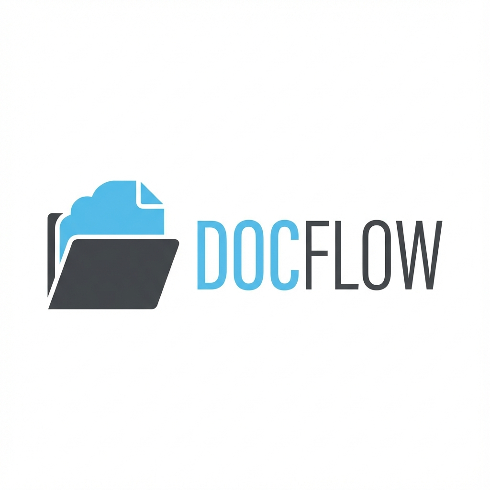

# Document Manager

> **Generated by [Antigravity](https://deepmind.google/technologies/gemini/antigravity/)** - Google DeepMind's AI-powered coding assistant

A modern, full-stack document management system with Google Drive integration and Google OAuth authentication. Upload, manage, and organize your documents with seamless cloud storage.



## 🌟 Features

- **Google OAuth Authentication** - Secure login with your Google account
- **Google Drive Integration** - Automatic backup of all documents to Google Drive
- **Document Upload & Management** - Support for PDF, DOC, DOCX, TXT, and image files
- **Real-time Document List** - View all your uploaded documents with metadata
- **File Preview & Download** - Quick access to your documents
- **Responsive Design** - Beautiful UI that works on all devices
- **Session Management** - Secure session handling with MongoDB
- **Docker Support** - Easy deployment with containerization

## 🚀 Tech Stack

### Backend
- **Node.js** with Express.js
- **MongoDB** with Mongoose ODM
- **Passport.js** for Google OAuth 2.0
- **Google Drive API** for cloud storage
- **Express Session** with MongoDB store

### Frontend
- **Vanilla JavaScript** - No framework overhead
- **Modern CSS** - Clean, responsive design
- **Google Fonts** - Inter font family

### DevOps
- **Docker** - Containerized deployment
- **Google Cloud Run** - Serverless deployment platform

## 📋 Prerequisites

- Node.js (v14 or higher)
- MongoDB instance (local or cloud)
- Google Cloud Project with:
  - OAuth 2.0 credentials
  - Google Drive API enabled

## 🔧 Installation

### 1. Clone the repository

```bash
git clone https://github.com/miftahul-huda/docman.git
cd docman
```

### 2. Install dependencies

```bash
npm install
```

### 3. Set up environment variables

Create a `.env` file in the root directory:

```env
# Server Configuration
PORT=3000
NODE_ENV=development

# MongoDB
MONGODB_URI=your_mongodb_connection_string

# Google OAuth
GOOGLE_CLIENT_ID=your_google_client_id
GOOGLE_CLIENT_SECRET=your_google_client_secret
GOOGLE_CALLBACK_URL=http://localhost:3000/auth/google/callback

# Session Secret
SESSION_SECRET=your_random_session_secret

# Google Drive (Optional - uses OAuth credentials)
GOOGLE_DRIVE_FOLDER_ID=your_drive_folder_id
```

### 4. Configure Google Cloud

1. Go to [Google Cloud Console](https://console.cloud.google.com/)
2. Create a new project or select existing one
3. Enable **Google Drive API**
4. Create OAuth 2.0 credentials:
   - Application type: Web application
   - Authorized redirect URIs: `http://localhost:3000/auth/google/callback`
5. Copy Client ID and Client Secret to `.env`

### 5. Run the application

**Development mode:**
```bash
npm run dev
```

**Production mode:**
```bash
npm start
```

The application will be available at `http://localhost:3000`

## 🐳 Docker Deployment

### Build and run with Docker

```bash
# Build the image
docker build -t docman .

# Run the container
docker run -p 3000:3000 --env-file .env docman
```

### Deploy to Google Cloud Run

```bash
gcloud run deploy docman \
  --source . \
  --region asia-southeast2 \
  --allow-unauthenticated \
  --set-env-vars MONGODB_URI=your_mongodb_uri,GOOGLE_CLIENT_ID=your_client_id,GOOGLE_CLIENT_SECRET=your_secret,SESSION_SECRET=your_session_secret
```

## 📁 Project Structure

```
docman/
├── models/
│   └── Document.js          # MongoDB document schema
├── routes/
│   └── documents.js         # Document API routes
├── public/
│   ├── index.html           # Main application page
│   ├── login.html           # Login page
│   ├── app.js               # Frontend JavaScript
│   ├── style.css            # Main styles
│   ├── staged-files.css     # Upload area styles
│   ├── google-logo.svg      # Google sign-in icon
│   └── logo.png             # Application logo
├── server.js                # Express server & configuration
├── package.json             # Dependencies
├── Dockerfile               # Docker configuration
├── .dockerignore            # Docker ignore rules
├── .gitignore               # Git ignore rules
└── README.md                # This file
```

## 🔐 Security Features

- **OAuth 2.0** - Secure authentication with Google
- **Session Management** - Encrypted sessions stored in MongoDB
- **Environment Variables** - Sensitive data stored securely
- **CORS Protection** - Configured for secure cross-origin requests
- **File Validation** - Upload restrictions and file type validation

## 📝 API Endpoints

### Authentication
- `GET /auth/google` - Initiate Google OAuth
- `GET /auth/google/callback` - OAuth callback
- `GET /auth/logout` - Logout user
- `GET /auth/user` - Get current user info

### Documents
- `GET /api/documents` - List all documents
- `POST /api/documents/upload` - Upload new document
- `GET /api/documents/:id/download` - Download document
- `DELETE /api/documents/:id` - Delete document

## 🎨 Features in Detail

### Google Drive Integration
All uploaded documents are automatically:
- Uploaded to your Google Drive
- Stored in a dedicated folder
- Backed up securely in the cloud
- Accessible from anywhere

### Document Management
- **Upload**: Drag & drop or click to upload
- **View**: See all documents with metadata (name, size, upload date)
- **Download**: Quick download from Google Drive
- **Delete**: Remove documents from both database and Drive

### User Experience
- Clean, modern interface
- Responsive design for mobile and desktop
- Real-time feedback on uploads
- Error handling and user notifications

## 🛠️ Troubleshooting

See [TROUBLESHOOTING.md](TROUBLESHOOTING.md) for common issues and solutions.

## 📄 License

ISC

## 🤖 About Antigravity

This application was generated using **Antigravity**, Google DeepMind's advanced AI coding assistant. Antigravity helps developers build full-stack applications quickly with:

- Intelligent code generation
- Best practices implementation
- Modern architecture patterns
- Production-ready code
- Comprehensive documentation

Learn more about Antigravity at [deepmind.google/technologies/gemini/antigravity/](https://deepmind.google/technologies/gemini/antigravity/)

## 🙏 Acknowledgments

- Built with Antigravity AI
- Google Cloud Platform for hosting
- MongoDB for database
- Google Drive API for storage

---

**Made with ⚡ by Antigravity**
